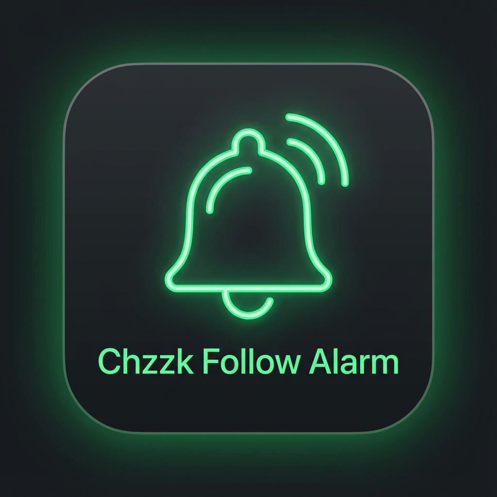

# Fazzk (치지직 팔로우 알림) - Tauri Edition

**Fazzk**는 치지직(Chzzk) 스트리머를 위한 **실시간 팔로우 알림 프로그램**입니다.  
기존 Electron 버전보다 훨씬 가볍고 빠르며, 방송 화면(OBS)에 투명 배경으로 완벽하게 통합됩니다.



## ✨ 주요 기능 (v2.0)

*   **⚡ 초경량 & 고성능**: Tauri 2.0 기반으로 재설계되어 메모리 사용량을 획기적으로 줄였습니다.
*   **🔔 실시간 알림**: 새 팔로워 감지 시 즉각적인 화면/소리 알림 (재팔로우 감지 포함)
*   **🎥 OBS 완벽 호환**:
    *   투명 배경 지원으로 게임 화면 위에 자연스럽게 오버레이
    *   OBS '브라우저 소스' 연동 (전용 URL 제공)
*   **🔄 자동 업데이트**: 새 버전 출시 시 앱 내에서 원클릭으로 다운로드 및 설치 지원
*   **📥 트레이 모드**: 창을 닫아도 시스템 트레이에서 백그라운드로 실행
*   **🎨 강력한 커스터마이징**:
    *   **알림음**: 사용자가 보유한 MP3/WAV 파일 사용 가능
    *   **테마**: 시스템 테마(다크/라이트) 자동 감지 및 수동 전환
    *   **애니메이션**: 페이드(Fade), 슬라이드(Slide), 바운스(Bounce) 등 다양한 효과

## 🚀 설치 및 실행

### Windows 설치
[Releases](https://github.com/minseok7891/fazzk/releases) 페이지에서 최신 버전의 설치 파일(`Fazzk_setup.exe` 또는 `.msi`)을 다운로드하세요.

### 직접 빌드하기
Rust와 Node.js 환경이 필요합니다.

```bash
# 1. 저장소 복제
git clone https://github.com/minseok7891/fazzk.git
cd fazzk

# 2. 의존성 설치
npm install

# 3. 개발 모드 실행
npm run tauri dev

# 4. 프로덕션 빌드 (확장 프로그램 포함)
npm run tauri build
```

## 📖 사용 방법

### 1. 확장 프로그램 설치 (필수)
네이버 로그인 세션을 연동하기 위해 브라우저 확장 프로그램이 필요합니다.
[Releases](https://github.com/minseok7891/fazzk/releases) 페이지에서 브라우저에 맞는 zip 파일을 다운로드하세요.

- **Chrome**: `chrome://extensions` → 개발자 모드 켜기 → "압축해제된 확장 프로그램을 로드합니다"
- **Firefox**: `about:debugging` → "임시 부가 기능 로드"

### 2. 로그인 연결
1. 브라우저에서 **네이버 로그인**을 완료합니다.
2. Fazzk 앱을 실행하면 확장 프로그램과 통신하여 자동으로 로그인됩니다.
3. 연결 성공 시 앱 상단에 프로필이 표시됩니다.

### 3. OBS 연동
1. 앱 내 **[사용 방법]** 메뉴 클릭
2. **OBS URL 복사** 버튼 클릭
3. OBS 소스 목록에서 **[브라우저]** 추가 후 URL 붙여넣기
   - 너비/높이: `1920` x `1080` (방송 해상도 권장)

## 🛠 기술 스택

*   **Frontend**: HTML, CSS, Alpine.js (Lightweight)
*   **Backend**: Rust (Tauri 2.0)
*   **Database**: `tauri-plugin-store` (설정 저장)
*   **API**: `reqwest` (치지직 통신)

## 📝 라이선스

ISC License
